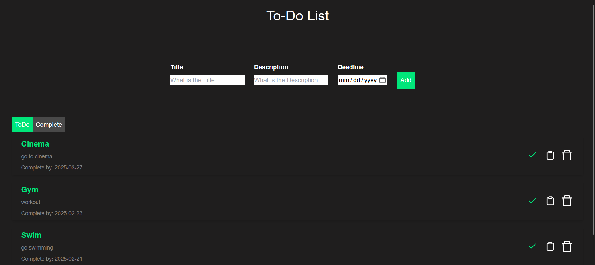

# Task Management Application

## Overview

This is a **Task Management** web application built as part of the Full-Stack Developer Intern task. The application allows users to create, edit, delete, and manage tasks with ease. The app demonstrates both **frontend** and **backend** development skills, and is built using **Node.js** with **Express** for the backend, and **React** for the frontend.

The main objective is to create a functional task management system that can handle CRUD operations (Create, Read, Update, Delete) for tasks, with proper API implementation and data persistence.

---

## Frontend Screenshots

### Homepage:
Displays the list of tasks with options to create, edit, and delete tasks.



---

## Key Features

1. **Task Management**:
   - Create, edit, delete, and mark tasks as completed.
   
2. **Backend API Development**:
   - Tech Stack: **Node.js** with **Express** for backend API development.
   - API Endpoints:
     - **GET /tasks**: Retrieve all tasks.
     - **POST /tasks**: Create a new task.
     - **PUT /tasks/:id**: Update an existing task (e.g., mark as completed or modify task details).
     - **DELETE /tasks/:id**: Remove a task.
   - Error Handling: Proper error handling with appropriate HTTP status codes and error messages (e.g., validation failures, missing resources).

3. **Data Persistence**:
   - Storage Mechanism: For simplicity, a **SQLite** database is used to persist task data. You can use another storage option if preferred.

---

## Data Model

The task model consists of the following fields:

- **id**: Unique identifier (string or number).
- **title**: Brief description of the task.
- **description**: (Optional) Detailed information about the task.
- **completed**: Boolean flag indicating task status (true for completed, false for incomplete).

---

## Tech Stack

- **Frontend**:
  - **React** (or **Next.js**) for the user interface.
  - **CSS/Tailwind CSS** for styling.
  
- **Backend**:
  - **Node.js** and **Express** for building the API.
  - **SQLite** (or other database options like MongoDB or JSON-based storage) for data persistence.
  
- **API Documentation**: 
  - The API is developed with RESTful principles for ease of use and testing.

---

## Setup Instructions

### Prerequisites

- **Node.js** installed on your machine.
- **SQLite** (or any preferred database) for storing tasks.

### Installation

1. **Clone the repository**:

   ```bash
   git clone https://github.com/yourusername/task-management-app.git
   ```

2. **Install backend dependencies**:

   ```bash
   cd task-management-app/backend
   npm install
   ```

3. **Install frontend dependencies**:

   ```bash
   cd ../frontend
   npm install
   ```

4. **Setup SQLite** (or other database):
   - The app uses SQLite by default. Ensure that the database file is created upon first run, or configure the database connection as needed.

5. **Run the backend**:

   ```bash
   cd backend
   npm run dev
   ```

6. **Run the frontend**:

   ```bash
   cd frontend
   npm run dev
   ```

7. **Open the application**:
   - Open the browser and go to `http://localhost:3000` for the frontend, and the backend will be running on `http://localhost:5000`.

---

## API Endpoints

### **GET /tasks**

- **Purpose**: Retrieve all tasks.
- **Response**:
  ```json
  [
    {
      "id": 1,
      "title": "Task Title",
      "description": "Task Description",
      "completed": false
    },
    ...
  ]
  ```

### **POST /tasks**

- **Purpose**: Create a new task.
- **Body**:
  ```json
  {
    "title": "New Task",
    "description": "Task details",
    "completed": false
  }
  ```
- **Response**:
  ```json
  {
    "message": "Task created successfully",
    "task": {
      "id": 1,
      "title": "New Task",
      "description": "Task details",
      "completed": false
    }
  }
  ```

### **PUT /tasks/:id**

- **Purpose**: Update an existing task or mark it as completed.
- **Body**:
  ```json
  {
    "title": "Updated Title",
    "description": "Updated Description",
    "completed": true // or false for editing
  }
  ```
- **Response**:
  ```json
  {
    "message": "Task updated successfully",
    "task": {
      "id": 1,
      "title": "Updated Title",
      "description": "Updated Description",
      "completed": true
    }
  }
  ```

### **DELETE /tasks/:id**

- **Purpose**: Delete a task.
- **Response**:
  ```json
  {
    "message": "Task deleted successfully"
  }
  ```

---

## Testing the API

To test the API, you can use tools like **Postman** or **curl**.

### Example:

1. **Create a new task**:
   - Send a **POST** request to `http://localhost:5000/tasks` with the body:

   ```json
   {
     "title": "New Task",
     "description": "This is a new task",
     "completed": false
   }
   ```

2. **Update a task**:
   - Send a **PUT** request to `http://localhost:5000/tasks/1` with the updated task details.

3. **Delete a task**:
   - Send a **DELETE** request to `http://localhost:5000/tasks/1`.

---

## Frontend Screenshots

- **Homepage**: Displays the task list with options to create, update, and delete tasks.
  - Screenshot 1: (Include a screenshot of the main task page)
  - Screenshot 2: (Include a screenshot of task detail page or task management view)

---

## Future Improvements

- **User Authentication**: Implement authentication to allow personalized task management.
- **Task Priorities**: Allow users to set priorities (e.g., High, Medium, Low).
- **Sorting/Filtering**: Enable sorting by task title or deadline, and filtering tasks by completion status.

---

## License

MIT License. See [LICENSE](LICENSE) for details.

---

## Conclusion

This **Task Management** web application demonstrates full-stack development skills with an easy-to-use interface for managing tasks. The backend is built with Node.js and Express, while the frontend uses React. With the given setup instructions, you should be able to run the app locally and test its full functionality.

---

### **Github Repository URL**: [https://github.com/Jithu-PR/Task-Management-App/](https://github.com/Jithu-PR/Task-Management-App/)

### **Live Demo URL**: [https://task-management-app-smoky-two.vercel.app/](https://task-management-app-smoky-two.vercel.app/)

--- 

Now the **live URL** is integrated into the README, so users can easily access your live application.
